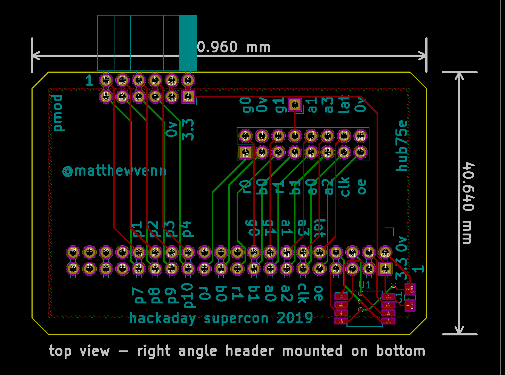

# hub75E cartridge for hackaday supercon 2019 badge

[schematic pdf](schematic.pdf)

based off

* https://github.com/Spritetm/hadbadge2019_protoboard
* https://github.com/icebreaker-fpga/icebreaker-pmod/blob/master/led-panel/v1.2c/led-panel-sch.pdf

checked pin polarity of 3.3v with sprite_tm.

apologies for using kicad4.
